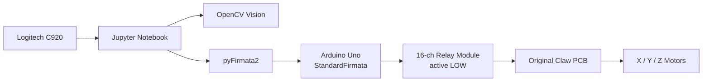
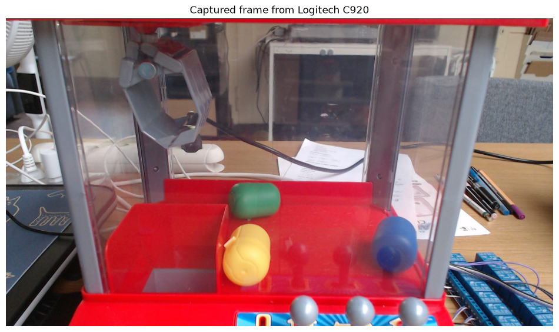
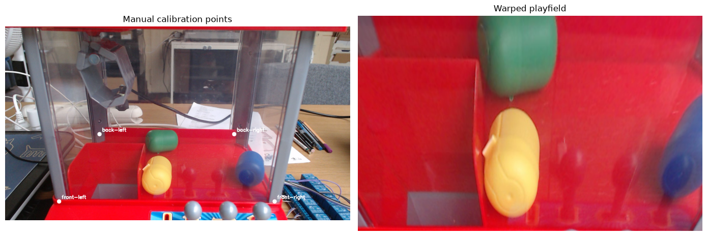
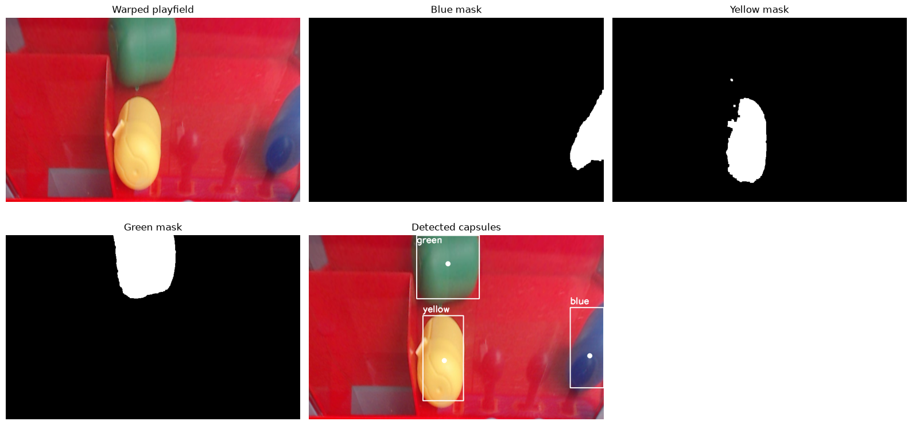

# Claw-Pilot

**Claw-Pilot** is a DIY computer-vision and Arduino control system for a small toy claw machine. The original electronics and motor drivers are preserved. Instead of replacing the control board, the system emulates the original DPDT joystick contacts using a 16-channel active-LOW relay module driven by an Arduino Uno. A Jupyter Notebook on the computer uses OpenCV to detect colored prize capsules from a fixed Logitech C920 webcam and sends movement commands to the Arduino through Firmata.

This is a **working prototype**, not production-ready firmware or vision software.

---

## Project Status

| Area | Status |
|------|--------|
| Relay-based motor control via Firmata | Working |
| Time-based percentage position model (X/Y/Z) | Working |
| OpenCV playfield calibration | Working |
| HSV capsule detection (blue, yellow, green) | Working |
| Pixel → cm → machine % coordinate mapping | Working |
| Automated move-to-capsule | Working |
| Automated pick-and-drop sequence | Working (prototype) |
| GAME ON / coin start via Firmata | **Not integrated** — manual for now |
| Claw position feedback | **None** — vision detects capsules, not the claw |
| Encoders / limit switches | **None** |

Primary entry point: `Claw-Pilot_Firmata_Motor_Control_GAME_MANUAL.ipynb`

Additional Arduino sketches in this repo are for standalone testing and calibration (`claw-pilot-calibration-time/`, `claw-pilot-position-controller/`, `claw_pilot_test_relay_thomas/`).

---

## High-Level Architecture

```text
Logitech C920 webcam
        │
        ▼
Jupyter Notebook (Python)
  ├── OpenCV: perspective calibration + HSV detection
  ├── Coordinate conversion: pixels → cm → machine %
  └── pyFirmata2: relay commands
        │
        ▼
Arduino Uno R3 (StandardFirmata)
        │
        ▼
16-channel 5V relay module (active LOW)
        │
        ▼
Original claw machine PCB / DPDT switch contacts
        │
        ▼
3× DC motors (X, Y, Z)
```



**Control model:** position is estimated by **dead reckoning** (timed relay pulses). There are no encoders, no limit switches, and no closed-loop claw tracking.

---

## Hardware

### Claw machine (preserved)
- Original PCB, motor drivers, and wiring retained
- Original control levers are **DPDT momentary spring-return switches**
- **3 DC motors:**
  - **X** — left/right gantry
  - **Y** — forward/back (prize chute = front)
  - **Z** — up/down (claw lift)

### Control electronics
| Component | Details |
|-----------|---------|
| Microcontroller | Arduino Uno R3 |
| Relay module | 16-channel, 5V, **active LOW** |
| Firmware (notebook path) | **StandardFirmata** |
| Computer interface | USB serial |
| Camera | Logitech C920, fixed frontal mount |

### Physical playfield (approximate)
| Dimension | Size |
|-----------|------|
| Width (X) | ~24 cm |
| Depth (Y) | ~15 cm |
| Height / Z travel | ~18 cm |

---

## Electrical Strategy

The design **does not replace** the original motor drivers. Relays are wired in parallel with (or in place of) the original DPDT switch contacts so the PCB still sees the same contact-closure behavior as manual joystick use.

Each motor direction requires **two relay channels**, matching the two independent contact closures of a DPDT switch pole pair.

Relay logic:
```text
LOW  (0) = relay ON  → motor direction active
HIGH (1) = relay OFF → motor direction inactive
```

**Startup safety (Firmata notebook workflow):** after connecting to Firmata, immediately configure Arduino pins **D2–D13** as outputs and write **HIGH** to all relay pins before sending any movement command. On this active-LOW module, **HIGH = relay OFF**. This matches the notebook's relay setup cell and helps avoid unintended relay activation during initialization.

**GAME ON / coin:** handled manually or outside the Firmata notebook workflow. The main notebook intentionally avoids A4/A5 (used by I²C on Firmata) to keep the D2–D13 motor mapping stable.

---

## Relay Mapping

Motor relays use Arduino digital pins **D2–D13**:

| Axis | Direction | Arduino pins |
|------|-----------|--------------|
| X | Right | D2, D3 |
| X | Left | D4, D5 |
| Y | Forward (toward prize chute / front) | D6, D7 |
| Y | Backward | D8, D9 |
| Z | Down | D10, D11 |
| Z | Up | D12, D13 |

Opposite directions are never driven simultaneously. A **150 ms dead time** is inserted between direction changes.

---

## Coordinate System

### Machine percentages (motion controller)

| Axis | 0% | 100% |
|------|-----|------|
| **X** | Left reachable limit | Right reachable limit |
| **Y** | Front / prize chute side | Back reachable limit |
| **Z** | Claw fully up | Claw fully down |

### HOME convention

Before calling `home()`, **manually** place the claw at:

```text
X = 0%   → left
Y = 0%   → front / prize chute side
Z = 0%   → claw fully up
```

Then run `home()` in the notebook to reset the internal position estimate. **HOME must be verified manually** before any automated movement. The software cannot confirm physical position.

### Reachable claw center area (cm)

The claw center cannot reach the full 24×15 cm playfield. Machine percentages map to this inner rectangle:

| Corner | X (cm) | Y (cm) |
|--------|--------|--------|
| Front-left | 5.0 | 4.0 |
| Front-right | 20.5 | 4.0 |
| Back-right | 20.5 | 10.5 |
| Back-left | 5.0 | 10.5 |

### Motor temporal calibration

Full-travel times (measured, dead reckoning):

| Axis | Full travel time |
|------|------------------|
| X (left ↔ right) | 10.8 s |
| Y (front ↔ back) | 5.0 s |
| Z (up ↔ down) | 2.5 s |

Movement duration for a percentage delta:

```text
duration = |target − current| / 100 × full_travel_seconds
```

---

## Vision Pipeline

The vision system detects **colored prize capsules**, not claw position.

```text
1. Capture frame from Logitech C920 (BGR)
2. Select four playfield corner points on the raw image
3. Apply OpenCV perspective transform → rectified playfield (800×500 px)
4. Convert BGR → HSV
5. Apply per-color HSV masks (blue, yellow, green)
6. Morphological open/close + contour detection
7. Take largest contour per color → capsule center (px)
8. Convert center px → playfield cm → machine X/Y %
9. Send percentages to motion controller
```

Raw camera input from the fixed Logitech C920 (step 1):



**Camera assumptions:**
- Fixed frontal position (through acrylic panel)
- Stable lighting
- Calibration valid only while camera pose and lighting remain unchanged

**Excluded from detection:** gray control levers at the bottom of the frame; red machine body (prize colors avoid red/orange/pink).

---

## Calibration Model

Calibration uses three related coordinate layers:

1. **Physical playfield coordinates (cm)** — positions on the full ~24×15 cm floor, derived from the rectified camera image
2. **Reachable claw-center coordinates (cm)** — the smaller inner rectangle where the claw center can actually travel
3. **Machine percentages (%)** — normalized 0–100% positions relative to the reachable claw-center rectangle, used by the motion controller

The four clicked calibration points define the **physical playfield plane** for camera rectification. They are used to rectify the camera image into centimeters. **Machine percentages are computed later** from the reachable claw-center rectangle, not directly from the clicked corners.

The reachable claw-center rectangle is **smaller than the full physical playfield**. A capsule detected near the playfield edge may still map to a clamped 0% or 100% machine coordinate.

### Playfield perspective calibration

Click four reference points on the raw camera frame that define the physical playfield plane, **in this order**:

1. **Front-left** (prize chute / front corner of the floor)
2. **Front-right**
3. **Back-right**
4. **Back-left**

OpenCV computes a perspective transform to a warped image sized **800×500 px**, preserving the physical aspect ratio (24 cm × 15 cm = 1.6). The result is a calibrated top-down playfield view in which pixel positions can be converted to physical centimeters.

In the warped image:
- **X** increases left → right
- **Y** in image space: top = back, bottom = front (inverted when converting to physical cm)

Manual corner selection on the raw frame (left) and the resulting warped playfield (right):



### Pixel → physical playfield (cm)

```text
x_cm = (cx / warped_width)  × 24.0
y_cm = (1 − cy / warped_height) × 15.0
```

### Physical playfield (cm) → machine percentage

Machine percentages are computed from the **reachable claw-center rectangle**, not from the full playfield corners:

```text
x_percent = (x_cm − 5.0)  / (20.5 − 5.0)  × 100
y_percent = (y_cm − 4.0)  / (10.5 − 4.0)  × 100
```

Results are clamped to 0–100%.

---

## Software Requirements

### Python (notebook host)
- Python 3.x
- Jupyter Notebook or JupyterLab
- Dependencies listed in `requirements.txt`:
  - `pyFirmata2` — Arduino Uno / StandardFirmata communication
  - `opencv-python` — camera capture, HSV segmentation, perspective transform
  - `numpy` — numerical operations
  - `matplotlib` — image display and calibration visualization
  - `jupyter` — run the notebook workflow

The notebook also uses Python standard-library modules (`sys`, `os`, `time`); no extra packages are required beyond `requirements.txt`.

### Arduino
- Arduino IDE
- **StandardFirmata** must already be uploaded to the Uno before running the notebook:
  ```text
  File → Examples → Firmata → StandardFirmata → Upload
  ```

### Optional standalone sketches
| Sketch | Purpose |
|--------|---------|
| `claw-pilot-calibration-time/` | Measure axis travel times via Serial Monitor |
| `claw-pilot-position-controller/` | Percentage moves via Serial commands (includes GAME ON on A5) |
| `claw_pilot_test_relay_thomas/` | Early relay wiring test |

---

## Setup Instructions

### 1. Hardware
1. Wire the 16-channel relay module to Arduino D2–D13 per the relay mapping table.
2. Connect relay outputs to emulate DPDT switch contacts on the original PCB.
3. Mount the Logitech C920 with a fixed frontal view of the playfield.
4. Connect Arduino Uno to the computer via USB.

### 2. Arduino
1. Upload **StandardFirmata** to the Uno.
2. Note the serial port (e.g. `/dev/cu.usbserial-XXXXX` on macOS, `COMx` on Windows).

### 3. Python environment

1. Clone or copy this repository.
2. Create the virtual environment:
   ```bash
   python3 -m venv .clawpilot
   ```
3. Activate it on macOS/Linux:
   ```bash
   source .clawpilot/bin/activate
   ```
4. Upgrade pip:
   ```bash
   python -m pip install --upgrade pip
   ```
5. Install dependencies:
   ```bash
   pip install -r requirements.txt
   ```
6. Start Jupyter:
   ```bash
   jupyter notebook
   ```

The `.clawpilot/` folder is a local virtual environment and should **not** be committed to git. It is listed in `.gitignore`.

### 4. Pre-flight
1. Power the claw machine appropriately.
2. **Manually start the game** (insert coin / press start — not automated in the notebook).
3. Manually jog the claw to the HOME position (front-left, fully up).
4. Keep hands clear of the playfield during automated runs.

---

## How to Run the Jupyter Notebook

1. Open the project directory and activate `.clawpilot` if it is not already active.
2. Start Jupyter (if not already running):
   ```bash
   jupyter notebook
   ```
3. Open `Claw-Pilot_Firmata_Motor_Control_GAME_MANUAL.ipynb`.
4. Run cells **in order** from top to bottom.
5. Update the serial port in the connect cell:
   ```python
   PORT = "/dev/cu.usbserial-XXXXX"  # your Arduino port
   ```
6. After connecting, run the relay configuration cell (D2–D13 → OUTPUT, all OFF).

---

## How to Calibrate the Playfield

1. Run the camera capture cell and confirm a clean frame from the C920.
2. Display the frame with coordinate grid (section 15A).
3. Read pixel coordinates for the four playfield corners.
4. Enter them in `src_points` (section 15B) in order: front-left, front-right, back-right, back-left.
5. Run the perspective transform cell.
6. Verify the warped output shows a rectangular playfield with correct orientation (front at bottom of image).

Re-calibrate whenever the camera moves, lighting changes significantly, or detection accuracy drifts.

---

## How to Detect Capsules

Default HSV ranges (OpenCV H: 0–179):

| Color | Lower (H, S, V) | Upper (H, S, V) |
|-------|-----------------|-----------------|
| Blue | 90, 80, 50 | 130, 255, 255 |
| Yellow | 18, 80, 80 | 38, 255, 255 |
| Green | 35, 40, 40 | 85, 255, 255 |

Detection steps:
1. Run playfield calibration to produce `playfield_bgr` / `warped_bgr`.
2. Run the detection cell — applies masks, morphology, and contour filtering (`MIN_CONTOUR_AREA = 500`).
3. Inspect mask and overlay plots for blue, yellow, and green.
4. Run coordinate conversion to populate `machine_detections`.

HSV masks and detected capsule centers on the calibrated playfield:



Tune HSV thresholds if capsules are missed or the red background causes false positives.

---

## How to Move to a Capsule

**Prerequisites:**
- Arduino connected and relays configured
- Game started manually
- Claw physically at HOME
- `home()` called in the notebook
- Fresh detection run (`machine_detections` populated)

```python
home()
list_available_targets(machine_detections)
move_to_capsule("blue")     # move to blue capsule, Z=0% (claw up)
move_to_capsule("yellow")
move_to_capsule("green")
```

`goto(x, y, z)` lifts the claw to Z=0% automatically before horizontal moves if the claw is down.

---

## How to Run a Pick Sequence

Default pick parameters in the notebook:

| Parameter | Default | Meaning |
|-----------|---------|---------|
| `PICK_Z_PERCENT` | 100.0 | Full down for grab |
| `DROP_Z_PERCENT` | 50.0 | Partial down at HOME to release |
| `PICK_SETTLE_TIME` | 0.5 s | Pause between steps |
| `RETURN_HOME_AFTER_PICK` | True | Return to X=0, Y=0 after grab |
| `DROP_AT_HOME_AFTER_PICK` | True | Lower at HOME to drop prize |

Sequence:
1. Move to target with claw up (Z=0%)
2. Lower claw to pick (Z=100%)
3. Raise claw (Z=0%)
4. Return to HOME (X=0%, Y=0%)
5. Lower partially at HOME to release (Z=50%)
6. Raise claw again (Z=0%)

```python
pick_capsule("blue")
# or
pick_at(x_percent, y_percent)
```

Success rate depends on claw mechanics, capsule shape, and calibration accuracy — expect tuning.

---

## Safety Notes

- **Active-LOW relays:** after Firmata connect, configure D2–D13 as outputs and write HIGH (OFF) before any movement command; incorrect sequencing can cause brief unwanted motor activation.
- **No hardware limits:** the controller will drive motors for the computed time even if the claw hits a mechanical stop.
- **Verify HOME manually** before `home()` and before automated sequences.
- **Lift before XY moves:** `goto()` enforces Z=0 before horizontal travel, but only relative to the *estimated* position.
- **Keep clear** of moving parts during tests.
- **Emergency stop:** call `all_off()` or disconnect relay/motor power.
- **One direction at a time:** relay pairs for opposite directions must never be active together.
- **Manual game start:** ensure the machine is in a playable state before motor commands.

---

## Known Limitations

- **Dead reckoning only** — no encoders, limit switches, or position feedback; error accumulates over moves.
- **HOME is not sensed** — the software trusts that the claw was placed correctly.
- **Vision detects capsules, not the claw** — there is no visual confirmation of grab success or final position.
- **Fixed camera required** — perspective calibration breaks if the C920 moves.
- **Lighting sensitive** — HSV thresholds may need adjustment under different illumination.
- **GAME ON not in Firmata path** — coin/start is manual to avoid A4/A5 conflicts.
- **Pick success not guaranteed** — grip strength, capsule geometry, and timing are not closed-loop controlled.
- **Single-machine calibration** — travel times and reachable area are specific to this unit.
- **Prototype notebook workflow** — not packaged as a library, service, or production deployment.

---

## Future Improvements

- [ ] Real-time preview UI instead of cell-by-cell notebook execution
- [ ] Logging and replay of pick attempts for tuning

### Interaction / personality layer

- [ ] Add speech output for robot status, detected targets, and pick/drop actions
- [ ] Add simple voice commands such as “pick blue”, “pick yellow”, and “return home”
- [ ] Explore a browser-based GUI with camera preview, target buttons, status logs, and robot voice
- [ ] Add an optional LLM/personality layer for conversational interaction, without giving the model direct low-level motor control

Any LLM or personality layer should **not** directly control relays or low-level motors. It should generate speech, interpret high-level commands, or suggest actions. Actual movement commands should remain validated by the local controller.

---

## Repository Layout

```text
SchoolAI-ClawPilot/
├── README.md
├── requirements.txt
├── .gitignore
├── output14.png                                         # Raw C920 camera frame
├── output15.png                                         # Playfield calibration example
├── output16.png                                         # Capsule detection example
├── Claw-Pilot_Firmata_Motor_Control_GAME_MANUAL.ipynb   # Main notebook (Firmata + OpenCV)
├── claw-pilot-calibration-time/
│   └── claw-pilot-calibration-time.ino                  # Serial time calibration
├── claw-pilot-position-controller/
│   └── claw-pilot-position-controller.ino             # Serial % position controller
├── claw-pilot-test-relay/
│   └── claw-pilot-test-relay.ino                        # GAME ON + relay movement test
└── claw_pilot_test_relay_thomas/
    └── claw_pilot_test_relay_thomas.ino                 # Early relay wiring test
```
